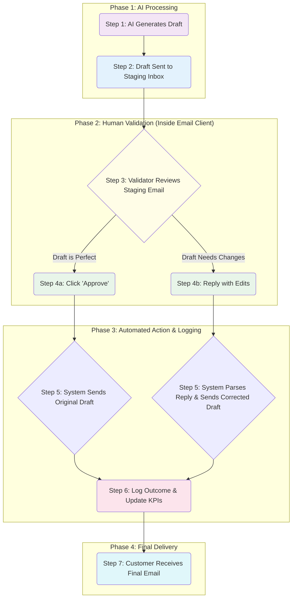

# AI Email Agent for Customer Support

## 1. Project Overview

This project will deliver a sophisticated AI-powered agent designed to streamline customer support by intelligently handling email inquiries. The primary goal is to automate the process of identifying customer needs for specific product and service and drafting accurate, helpful email responses.

The solution is built on a foundation of **secure, reliable automation with robust human oversight.** It addresses the core challenge of managing repetitive, high-volume email inquiries, freeing up valuable human time to focus on more complex customer issues. This document outlines our strategic approach, architecture, and the planned development process.

---

## 2. System Architecture & Workflow

We have designed a modular and scalable architecture that ensures security and efficiency. The entire process is built around a frictionless "human-in-the-loop" validation system, which is detailed below.

```mermaid
graph TD
    subgraph "Customer Interaction"
        A[Customer sends email] --> B(Gmail Inbox)
    end

    subgraph "AI Email Agent System"
        C[Email Ingestion Service] --> D{AI Analysis & Orchestration}
        D --> E[Tools Execution]
        E --> F[Draft Generation]
        %% Details for Tools Execution:
        %% - Query Products
        %% - Get History
    end
    
    subgraph "Human Validation Loop"
        F --> G[Staging Inbox - validation"]
        G --> H[Human Review in Email Client"]
        H -- "Approve" --> I[Send to Customer]
        H -- "Edit & Reply" --> I
    end

    subgraph "Data & Knowledge"
        KB[(Knowledge Base<br/>Products & FAQs)]
        DB[(Project Database<br/>Emails, Drafts, Logs)]
    end

    B --> C
    D --> KB
    E --> DB
    I --> B

    style D fill:#e3f2fd
    style H fill:#fffde7
```

---

## 3. The Validation Process: Simple, Reliable, and Seamless

A cornerstone of this project is a user-friendly validation workflow that empowers human oversight without creating tedious work. I want to come up with a **"Staging Inbox"** solution that integrates directly into the standard email client, requiring no separate applications or complex procedures.

Here is a step-by-step breakdown of this carefully planned process:



This workflow ensures that every AI-generated response is validated, while making the process of approving or correcting drafts as simple as clicking a link or replying to an email.

### How It Works: A Detailed Breakdown

*   **Step 1: AI Generates a Draft**
    After analyzing a customer's email, the AI agent generates a complete draft response, including the proposed text and correct product URL.

*   **Step 2: Draft is Sent to the "Staging Inbox"**
    Instead of appearing in the user's outbox, the draft is sent to a dedicated internal email address (e.g., `validation@yourcompany.com`). This address acts as a controllable checkpoint that the system monitors.

*   **Step 3: Validator Reviews the Staging Email**
    The validator receives this staging email in their regular inbox. They can review the proposed AI response without leaving their familiar email client.

*   **Step 4: The Validator Takes Action**
    *   **If the draft is perfect,** the validator clicks an **"Approve & Send"** link within the email.
    *   **If the draft needs changes,** the validator simply **replies** to the email, editing the text directly in the reply body. They can also add notes for feedback (e.g., `Error Type: Incorrect Tone`).

*   **Step 5: The System Automatically Processes the Action**
    The backend system detects the validator's action. It either sends the original draft (if approved) or the new, corrected version (if edited) to the customer.

*   **Step 6: The Outcome is Logged**
    Every action is logged. If a draft was corrected, both the original and the final versions are saved. This provides invaluable data for tracking the AI's accuracy and improving its performance over time.

*   **Step 7: The Customer Receives the Final Email**
    The customer receives a single, polished response, seamlessly integrated into their original email thread.

---

## 4. Project Development Stages

Development will proceed through three distinct, fixed-price milestones to ensure clarity, accountability, and consistent progress.

*   **Milestone 1: Audit & Architecture**
    *   **Focus:** Finalize the technical architecture, security protocols, and a detailed implementation plan.
    *   **Outcome:** A complete project blueprint and a secure foundation for development.

*   **Milestone 2: Working Test Flow (Proof of Concept)**
    *   **Focus:** Develop the core agent functionality, including email ingestion, AI analysis, and draft generation into the staging inbox.
    *   **Outcome:** A functional, end-to-end system ready for internal testing and validation.

*   **Milestone 3: Full Validation Mode & Deployment**
    *   **Focus:** Build out the complete validation workflow, implement robust error handling, and deploy the application to a production environment.
    *   **Outcome:** A fully operational and deployed AI Email Agent ready for real-world use.

---

## 5. Detailed Project Plan

This project is meticulously planned from start to finish. For a granular, task-by-task breakdown of the entire development process, please refer to the following file:

*   **Project Plan:** [`/.taskmaster/tasks/tasks.json`](./.taskmaster/tasks/tasks.json)

This file serves as the single source of truth for all development activities, dependencies, and priorities, demonstrating our commitment to transparent and organized project management.
